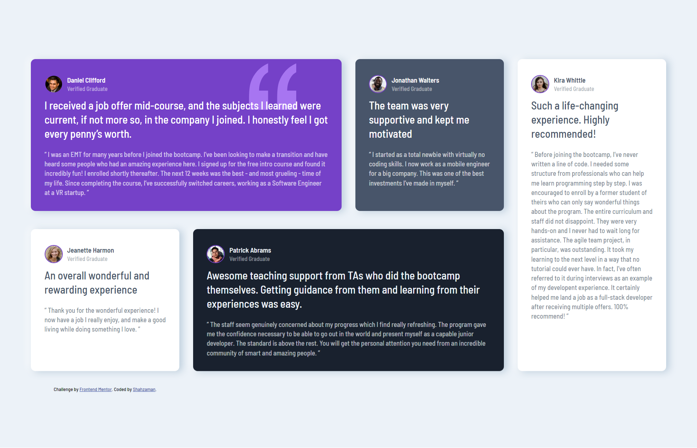

# Frontend Mentor - Testimonials grid section solution

This is a solution to the [Testimonials grid section challenge on Frontend Mentor](https://www.frontendmentor.io/challenges/testimonials-grid-section-Nnw6J7Un7). Frontend Mentor challenges help you improve your coding skills by building realistic projects. 

## Table of contents

- [Overview](#overview)
  - [The challenge](#the-challenge)
  - [Screenshot](#screenshot)
- [My process](#my-process)
  - [Built with](#built-with)
  - [What I learned](#what-i-learned)
- [Author](#author)
- [Acknowledgments](#acknowledgments)

## Overview

### The challenge

Users should be able to:

- View the optimal layout for the site depending on their device's screen size

### Screenshot

## My process

### Built with

- Semantic HTML5 markup
- CSS custom properties
- Flexbox
- CSS Grid

### What I learned

I think I'm a little bit more confident with CSS Grid now after doing this project but still gotta do more layout designs to get even further expertise.

## Author
- Frontend Mentor - [Shazee17](https://www.frontendmentor.io/profile/Shazee17)

## Acknowledgments

I actually did a Crash course related to CSS Grid of [Traversery Media](https://www.youtube.com/watch?v=0xMQfnTU6oo&t=406s) on Youtube and This was its project.

